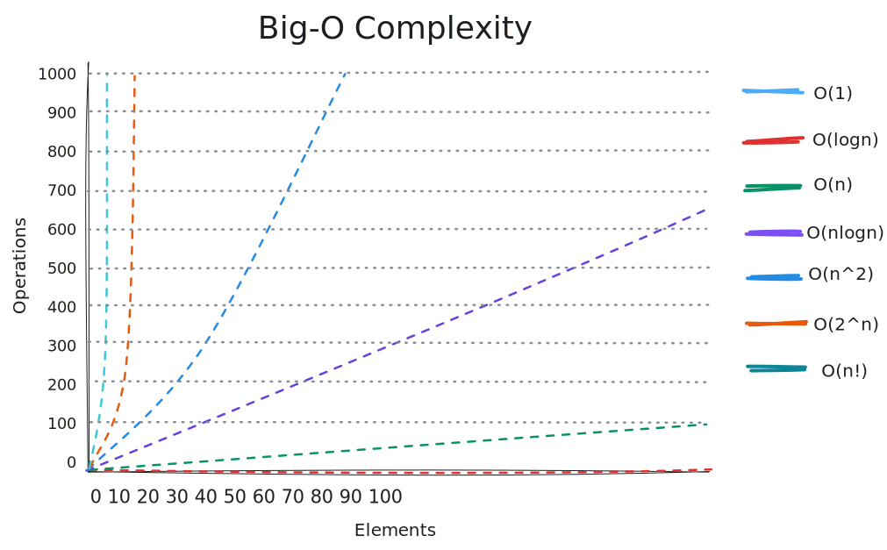

- it's a way to categorize your algorithms time or memory requirements based on input
- the use of Big-O is to help choosing more performant algorithms
- as your input grows, how fast does computation and/or memory grow?

An example:

```ts
function sum_char_codes(n: string): number {
  let sum = 0;
  for (let i = 0; i < n.length; ++i) {
    sum += n.charCodeAt(i);
  }

  return sum;
}
```

- the example shows a O(N) time complexity, which means that as the input grows so does the time complexity and it happens linearly
- the simplest trick to spot the complexity is to look for loops
- in Big-O you look for the worst case, so if a loop has a condition to stop when it finds a char in your input, doesn't matter cause that char can be in the end of the input



- O(sqrt(n)) is a cool big-o complexity we'll see later
