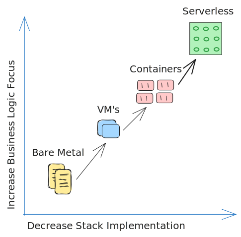

## What is Serverless?

Serverless is a cloud computing execution model where the cloud provider dynamically manages the allocation and provisioning of servers. A serverless application runs in stateless compute containers that are event-triggered and fully managed by the cloud provider.

### Serverless Providers

- **AWS Lambda**: If you've deployed anything to **Vercel**, you've used AWS Lambda, since Vercel uses it under the hood.
- **Azure Functions**
- **Google Cloud Functions**
- And others...

### Increase Business Logic Focus X Decrease Stack Implementation

- **Bare Metal**: You have to manage everything, from the hardware to the application.
- **Virtual Machines**: Resource optimization, but you still have to manage your environment.
- **Containers**: Package your application with its dependencies, simplifying the deployment process, but still have some challenges.
- **Serverless**: You only have to worry about your application code. Use an Event-Driven approach to trigger your functions. The cloud provides FaaS (Functions as a Service).

*Note: I'm not gonna dive too deep into this subject, cause I'm already bored.*
