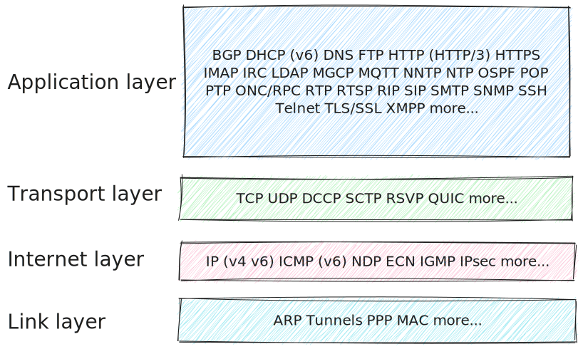

It's a set of rules that defines how entities can communicate.

- protocols implementations are called "frameworks"

## Internet

- on server x client there are normally various layers of protocol in order to communicate

## HTTP

- consists in a text message format protocol
- it runs over tcp connection

## TCP

"TCP provides reliable, ordered, and error-checked delivery of a stream of octets (bytes) between applications running on hosts communicating via an IP network." - Wikipedia

### TCP segment structure

"Transmission Control Protocol accepts data from a data stream, divides it into chunks, and adds a TCP header creating a TCP segment. The TCP segment is then encapsulated into an Internet Protocol (IP) datagram, and exchanged with peers. Processes transmit data by calling on the TCP and passing buffers of data as arguments." - Wikipedia

[See more](https://en.wikipedia.org/wiki/Transmission_Control_Protocol#TCP_segment_structure).

## References

- [What is a protocol from LiveOverflow on YouTube](https://www.youtube.com/watch?v=d-zn-wv4Di8)
- [TCP on Wikipedia](https://en.wikipedia.org/wiki/Transmission_Control_Protocol)
- [StackOverflow](https://stackoverflow.com/questions/35070594/oauth-2-is-a-protocol-or-a-framework)
